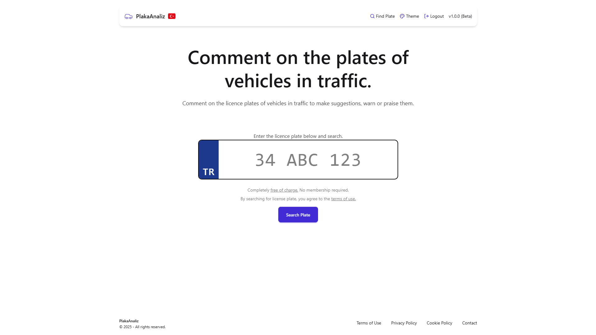
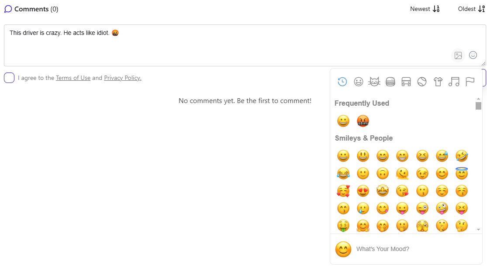
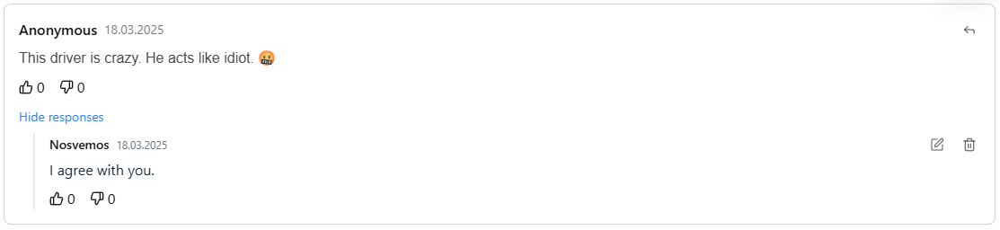
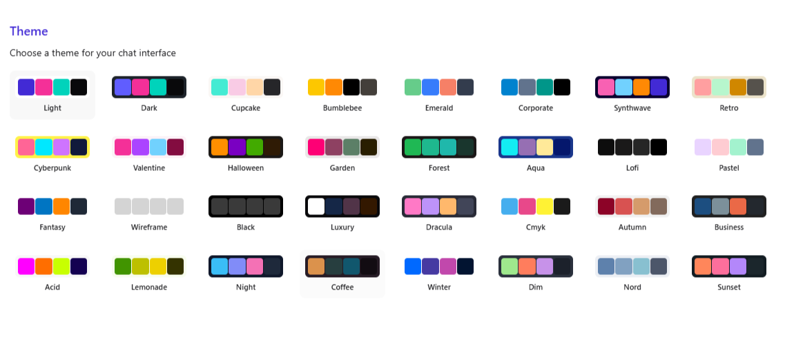

# PlakaAnaliz | Evaluate and discuss drivers in traffic

💬 Comment on Plates:
```
Anonymous or Account-Based: Users can choose to comment anonymously or with their registered account. Also, they can add image to comments for fun!

Rich Text Support: Emojis are supported in comments.

Real-Time Updates: New comments appear instantly without page refresh.
```
🔄 Reply to Comments:
```
Nested Replies: Reply to specific comments, creating threaded discussions.

Edit/Delete: Users can edit or delete their replies within a time limit.
```
👍👎 Like/Dislike Comments & Replies:
```
Reaction System: Users can like or dislike comments and replies to express their opinion.

Reaction Counts: Display the number of likes and dislikes for each comment/reply.

User-Specific Reactions: Highlight the user's own reaction (e.g., if they liked or disliked).
```

## Screenshots







## Technologies Used

**Frontend:** React, Zustand, Tailwind CSS, DaisyUI

**Backend:** Node.js, Express.js, Mongoose

**Database:** MongoDB


## Environment Variables

To run this project you will need to add the following environment variables to your .env file.

```
MONGODB_URI=
JWT_SECRET=

CLIENT_URL=
PORT=

CLOUDINARY_API_KEY=
CLOUDINARY_API_SECRET=
CLOUDINARY_CLOUD_NAME=

NODE_ENV=production (optional)
```

